.. _universe_deployer:

Universe Deployer
#################

IDC Universe Deployer is a set of Go applications and Bazel rules that enables a declarative method
to deploy Helm releases for IDC services to production and non-production environments.

Universe Deployer is a key part of the IDC services upgrade procedure.
See :ref:`services_upgrade_procedure` for more information.

The source of truth for IDC Universe Deployer is a declarative file referred to as the Universe Config file,
which maps each IDC component to a Git commit hash within the IDC monorepo.
Components in different regions and AZs can point to different commit hashes.
The commit hash for a component defines the precise and reproducible set of
container images, Helm charts, and Helm release values.

The output of Universe Deployer is a new commit added to the main branch of the `idc-argocd`_ Git repo.

Universe Deployer also pushes container images and Helm charts to Harbor.

Universe Config File
********************

The Universe Config File is a JSON file as shown below.

.. code-block:: console
   
   {
      "environments": {
        "prod": {
          "components": {
            "billing": {
              "commit": "3ec06189f366d34723cf2c3355c9637241e55609"
            },
            "cloudaccount": {
              "commit": "3ec06189f366d34723cf2c3355c9637241e55609"
            },
            "grpc": {
              "commit": "222cbd37286304a4f58489c3b17174a7746efcd0"
            },
            "metering": {
              "commit": "3ec06189f366d34723cf2c3355c9637241e55609"
            },
            // ...
          },
          "regions": {
            "us-region-1": {
              "components": {
                "computeApiServer": {
                  "commit": "222cbd37286304a4f58489c3b17174a7746efcd0"
                },
                "computeBm": {
                  "commit": "3ec06189f366d34723cf2c3355c9637241e55609"
                },
                "computeBmEnrollment": {
                  "commit": "3ec06189f366d34723cf2c3355c9637241e55609"
                },
                "grpc": {
                  "commit": "3ec06189f366d34723cf2c3355c9637241e55609"
                },
                "iks": {
                  "commit": "3ec06189f366d34723cf2c3355c9637241e55609"
                },
                "storage": {
                  "commit": "3ec06189f366d34723cf2c3355c9637241e55609"
                },
                // ...
              },
              "availabilityZones": {
                "us-region-1a": {
                  "components": {
                    "computeBmInstanceOperator": {
                      "commit": "3ec06189f366d34723cf2c3355c9637241e55609"
                    },
                    "computeVmInstanceOperator": {
                      "commit": "3ec06189f366d34723cf2c3355c9637241e55609"
                    },
                    "iks": {
                      "commit": "3ec06189f366d34723cf2c3355c9637241e55609"
                    },
            // ...

Each global component can have a different commit hash.
Each regional component in each region can have a different commit hash.
Each AZ component in each AZ can have a different commit hash.
Any commit that is available in the `IDC monorepo`_ can be used.

All binaries and configuration related to a component will be built from the specified commit for that component.
If a component is not included in the Universe Config File, then it will not be deployed and will be deleted if it is already deployed.

A single Universe Config File can define multiple enviroments.
Multiple Universe Config Files can also coexist, as long as they define different environments.

To allow for careful control over production, production will have a dedicated file named prod.json which
can be protected using a ``CODEOWNERS`` file.

.. note::
   In the future, Universe Deployer can perform checks (perhaps by querying test results in Jenkins)
   to ensure that only authorized commits are permitted in the production Universe Config File.

High-level Architecture
***********************

.. figure:: ../_figures/guides/universe_deployer_architecture_high_level.svg

.. Image source: https://intel.sharepoint.com/:u:/r/sites/inteldevelopercloud/Shared%20Documents/IDC%20Phase%201.0%20Materials/Deployment/Universe%20Deployer.drawio?csf=1&web=1&e=f7ifoc

Universe Deployer performs the steps below.

#.  Find unique commits in all Universe Config files.

#.  For each commit, find the set of components with that commit.

#.  For each unique commit:

    #.  For each component with this commit.

        #.  Ensure that the commit has been authorized to deploy to the target environments.
            (Method TBD.)

        #.  Clone `IDC monorepo`_ at the specific commit.

        #.  Build container images and Helm charts.

        #.  Build Argo CD manifests (config.json and Helm values.yaml).

        #.  Push containers and Helm charts to Harbor. 
            Commits in `Universe Config prod`_ will be deployed to production Harbor.
            Commits in `Universe Config staging`_ will be deployed to staging Harbor.

#.  Combine Argo CD manifests from each commit.
    The combined result will be 100% authoritative and declarative for all IDC services in all production and staging clusters.
    It will reflect upgraded Helm releases, updated containers, updated values.yaml, new Helm releases, deleted Helm releases,
    and renamed Helm releases.

#.  Create a new commit in the main branch of the `idc-argocd`_ Git repo with the combined Argo CD manifests.

IDC Components and Helm Releases
********************************

Universe Deployer allows individual IDC components to be built and deployed separately.
Each IDC component is mapped to a set of Helm releases.

For example, the "iks" component in the production environment and us-region-1a availability zone
maps to the following Helm releases:

- us-region-1a-ilb-crds
- us-region-1a-ilb-operator
- us-region-1a-kubernetes-crds
- us-region-1a-kubernetes-operator
- us-region-1a-kubernetes-reconciler

The mappings must be defined in multiple ways and the resulting mappings must be consistent with each other.

#.  In the file ``/deployment/artifacts.bzl``, each IKS artifact must have the "components" value set to ``["iks"]``.

#.  The Helm releases for component "iks" must be in the file ``/deployment/helmfile/helmfile-iks.yaml``.

#.  Within the above file, the Helm releases must have the "component" label set to "iks".

Mappings from components to Helm releases may be different for each commit.
In the example above, a future commit may define separate "iksIlb" and "iksKubernetes" components to allow these
Helm releases to use different Git commits.
However, it must be ensured that the same Helm release name is not generated by multiple Git commits.

Deletion of Helm Releases
*************************

When Universe Deployer generates Argo CD manifests, any unknown Helm releases in *owned* directories will be deleted.
All directories two levels up from the generated values.yaml files are considered owned by the Universe Deployer.
For example, since Universe Deployer created the file
``/applications/idc-regional/us-staging-1/pdx05-k01-rgcp/us-staging-1-compute-api-server/values.yaml``,
it owns the directory
``/applications/idc-regional/us-staging-1/pdx05-k01-rgcp`` and everything under it.
This is apparent to users by the presence of a file named ``OWNED_BY_UNIVERSE_DEPLOYER.md`` in all owned directories.
This file is created by Manifests Generator along with ``config.json`` and ``values.yaml``.

The file ``OWNED_BY_UNIVERSE_DEPLOYER.md`` contains the following text:

  # Owned by Universe Deployer

  This directory and any other directory containing a file named OWNED_BY_UNIVERSE_DEPLOYER.md are owned by Universe Deployer.
	
  **Universe Deployer may automatically replace the entire contents of owned directories at any time.**

When Git Pusher runs, it identifies owned directories by finding ``OWNED_BY_UNIVERSE_DEPLOYER.md`` files
in the *new* Argo CD manifests tar generated by Manifests Generater.
It then deletes these owned directories from the new branch created in `idc-argocd`_.

  .. warning::
     When reviewing the `idc-argocd`_ PR, pay particular attention to any Helm releases that are deleted or renamed.
     Depending on the configuration of the Argo CD ApplicationSet and Applications, deleted or renamed Helm releases
     may cause the associated Kubernetes resources to be permanently deleted.

  .. note::
     Universe Deployer will not delete a directory if all Helm releases have been removed from it.
     This is a safety mechanism.
     If an entire directory needs to be deleted, perhaps to decomission a Kubernetes cluster,
     then a manual PR should be created to accomplish this.

Universe Deployer in Jenkins
****************************

IDC Universe Deployer runs in a Jenkins pipeline on the **main** branch of `IDC monorepo`_.
It runs in the *Bazel Universe Deployer* stage defined in ``/Jenkinsfile``.

Troubleshooting
===============

The log of the nested execution of Bazel can be found in a file such as:
``~/.cache/bazel/_bazel_claudiof/5899c1825136666a3ddb04834a591e09/execroot/com_intel_devcloud/bazel-out/_tmp/actions/stderr-*``.

Detailed Architecture
*********************

.. figure:: ../_figures/guides/universe_deployer_architecture_detailed.svg

.. Image source: https://intel.sharepoint.com/:u:/r/sites/inteldevelopercloud/Shared%20Documents/IDC%20Phase%201.0%20Materials/Deployment/Universe%20Deployer.drawio?csf=1&web=1&e=f7ifoc

Components of Universe Deployer
*******************************

Bzl File Embed (Bazel Repository Rule)
======================================

Bzl File Embed is a Bazel repository rule that allows the *contents* of an arbitrary file in the Bazel workspace
to be accessible to Bazel rules during the Bazel analysis stage.
This is used by Universe Deployer to read Universe Config Files and generate actions based on the commits within
these files.

Source Code
~~~~~~~~~~~

* /build/bzl_file_embed/bzl_file_embed.bzl

Git Archive (Bazel Repository Rule)
===================================

*Git Archive* is a Bazel repository rule that runs ``git archive`` to generate a tar file from each of multiple commits of the `IDC monorepo`_.

In addition, it can be provided a list of files which it will read from each commit and whose content it will store in a dict in defs.bzl.
This dict can be used by Bazel rules during the analysis stage.
This mechanism is used to determine commits that may lack new Bazel targets.

Inputs
~~~~~~

#. Universe Config Files

#. Git remote URL

Outputs
~~~~~~~

#. For each commit, a tar file generated with ``git archive``.

#. A file named ``defs.bzl`` with a dict that contains the contents of specified files from each commit.

Source Code
~~~~~~~~~~~

*  /build/git_archive/git_archive.bzl

Universe Deployer (Bazel Macro)
===============================

universe_deployer is a Bazel macro that calls the Bazel rules Manifests Tar and Git Pusher.
The file ``deployment/universe_deployer/BUILD.bazel`` instantiates ``main_universe_deployer``
which is responsible for the *owned* directories in the **main** branch of `idc-argocd`_.

Source Code
~~~~~~~~~~~

*  /deployment/universe_deployer/universe_deployer.bzl

Manifests Tar (Bazel Rule)
==========================

_manifests_tars is a Bazel rule for running Builder Pusher and Manifests Generator for each commit,
then combining the results into a single manifests tar file.

Source Code
~~~~~~~~~~~

*  /deployment/universe_deployer/universe_deployer.bzl

Builder Pusher
==============

Universe Deployer Builder Pusher is a small Go application that builds various artifacts from a specific commit,
then pushes container images and Helm charts to Harbor.
The Builder Pusher binary built from main is executed.

Inputs
~~~~~~

#. Universe Config File

#. Git commit hash

#. Component name

#. Output of Git Archive for a specific commit and component.

Outputs
~~~~~~~

#. Deployment artifacts tar (see :ref:`deployment_artifacts`)

Steps
~~~~~

#. Extract Git archive for a specific commit.

#. Run ``bazel build //deployment/universe_deployer/deployment_artifacts:deployment_artifacts_COMPONENT_tar``
   where COMPONENT is the name of the component.

#. Run ``bazel build //go/pkg/universe_deployer/cmd/pusher`` to build the Pusher binary.

#. Run Pusher binary created by the previous step.

Source Code
~~~~~~~~~~~

*  /go/pkg/universe_deployer/cmd/builder_pusher
*  /deployment/universe_deployer/universe_deployer.bzl

Pusher
======

Universe Deployer Pusher is a small Go application that pushes container images and Helm charts to Harbor.
The Pusher binary built from a specific commit (not main) is executed.

Inputs
~~~~~~

#. Universe Config File

#. Git commit hash

#. Component name

#. Extracted Git archive for a specific commit and component

#. Secrets to login to the Docker and Helm registries

#. Helm binary

Outputs
~~~~~~~

#. Container images and Helm charts are pushed to Harbor.

Steps
~~~~~

#. Login to the Docker and Helm registries.

#. Run ``bazel run //deployment/push:COMPONENT_component_container_and_chart_push``.
   This will build and push all container images and Helm charts to Harbor.

Source Code
~~~~~~~~~~~

*  /go/pkg/universe_deployer/cmd/pusher

Commit Runner
=============

Universe Deployer Commit Runner is a small Go application that extracts a tar file to a temporary directory,
then runs a binary from the temporary directory.
This is used by the universe_deployer Bazel rule to launch the Manifests Generator built from a specific commit.
The Commit Runner binary built from main is executed.

Input
~~~~~

#. Universe Config File

#. Git commit hash

#. Component name

#. Deployment artifacts tar generated by Builder Pusher for a specific commit.

Output
~~~~~~

#. See output of Manifests Generator.

Steps
~~~~~

#. Extract deployment artifacts tar generated by Builder Pusher for a specific commit

#. Run Manifests Generator binary.

Source Code
~~~~~~~~~~~

*  /go/pkg/universe_deployer/cmd/commit_runner

Manifests Generator
===================

Universe Deployer Manifests Generator is a Go application that generates Argo CD manifests,
which consists of a set of config.json and values.yaml files for each Helm release.
It uses Helmfile.
The Manifests Generator binary built from a specific commit (not main) is executed.

Inputs
~~~~~~

#. Universe Config File

#. Git commit hash

#. Component name

#. Extracted deployment artifacts tar generated by Builder Pusher for a specific commit.

Outputs
~~~~~~~

#. Argo CD manifests tar - Argo CD manifests, which consists of a set of config.json and values.yaml files for each Helm release

Steps
~~~~~

#. Read Universe Config to identify IDC components enabled for this specific commit.

#. Use ``helmfile write-values`` to generate a values.yaml file for each Helm release that uses this commit.
   Helmfile uses the file named ``helmfile-COMPONENT.yaml`` where COMPONENT is the component name.

#. Use ``helmfile list`` to get additional metadata about required Helm releases.

#. Write config.json file for each Helm release that uses this commit.

#. Combine all values.yaml and config.json files into an Argo CD manifests tar.
   This will have the same directory structure as `idc-argocd`_.

Source Code
~~~~~~~~~~~

*  /deployment/universe_deployer/universe_deployer.bzl
*  /go/pkg/universe_deployer/cmd/manifests_generator

Git Pusher (Bazel Rule)
=======================

_git_pusher is a Bazel rule for running Git Pusher.

Source Code
~~~~~~~~~~~

*  /deployment/universe_deployer/universe_deployer.bzl

Git Pusher
==========

Universe Deployer Pusher is a small Go application that pushes Argo CD manifests to the `idc-argocd`_ Git repository.
The Git Pusher binary built from main is executed.

Input
~~~~~

#. Argo CD manifests tar built by Manifests Generator

#. Git remote URL and branch

Output
~~~~~~

#. A new branch in the `idc-argocd`_ Git repository is created.

Steps
~~~~~

#. Clone the main branch of `idc-argocd`_.

#. Delete any directories owned by Universe Deployer.

#. Extract the Argo CD manifests tar on top of the local branch.
   The local branch will contain new and updated Argo CD manifests.
   The local branch will not contain any files or directories that should be deleted,
   which would occur if Helm releases are removed or renamed.

#. If there are any changes, add a new Git commit.

#. If the Jenkins pipeline ran from the main branch, then push the local branch to main branch of `idc-argocd`.
   This condition prevents non-authorative, unmerged Universe Config files from getting merged into `idc-argocd`.
   When this condition is not satisfied, Git Pusher essentially runs in in a dry-run mode.
   Developers can review the log file to view the effective git diff.

Source Code
~~~~~~~~~~~

*  /go/pkg/universe_deployer/cmd/git_pusher
*  /deployment/universe_deployer/universe_deployer.bzl

.. _deploy_all_in_k8s:

Deploy All In K8s
*****************

Deploy All In K8s is a Go application that is launched by Jenkins pipelines to deploy IDC to some development environments.
It is used by dev20 through dev39 environments and will be used by additional environments.

To learn how to use it, see :ref:`services_upgrade_procedure_development`.

Architecture
============

Source Code
===========

*  /go/pkg/universe_deployer/cmd/deploy_all_in_k8s

Source Files Used by Universe Deployer
**************************************

Most of the IDC Universe Deployer binaries and data files used are based on the **main** branch of `IDC monorepo`_.
However, when IDC Universe Deployer builds container images, Helm charts, and Argo CD manifests,
it uses some binaries and data files based on a component-specific commit referenced in the Universe Config File.

Source Files Used from the Main Branch
======================================

- /BUILD.bazel

- /WORKSPACE

- /build

  - bzl_file_embed
  - git_archive
  - (other files referenced by /WORKSPACE)

- /deployment/universe_deployer

  - BUILD.bazel
  - main_universe_defs.bzl
  - universe_config.bzl
  - universe_deployer.bzl

- /deployment/universe_deployer/environments

  - prod.json
  - staging.json

- /go/pkg/universe_deployer/cmd

  - builder_pusher
  - commit_runner
  - git_pusher

.. _deployment_artifacts:

Source Files Used from a Component-specific Commit
==================================================

- Dependencies of Bazel target //deployment/universe_deployer/deployment_artifacts:deployment_artifacts_COMPONENT_tar
  where COMPONENT is the name of the component
  (defined in /deployment/universe_deployer/BUILD.bazel)

  - /WORKSPACE

    - Helm3 binary helm3_linux_amd64
    - Helmfile binary helmfile_linux_amd64

  - /build/environments

  - Dependencies of Bazel target //deployment:COMPONENT_chart_versions
    where COMPONENT is the name of the component
    (defined in /deployment/BUILD.bazel)

    - This is a set of files containing all Helm chart versions for the component.
      Helm chart versions depend on chart contents, which depend on container image hashes.
      Therefore this is dependent on all .go source files used to build container images for the component.

  - /deployment/helmfile

  - /deployment/universe_deployer/config.yaml

    - This contains configuration used by pusher and manifests_generator, such as the Harbor address for each environment.

  - /go/pkg/universe_deployer/cmd

    - manifests_generator
    - pusher

- /.bazeliskrc

  - This file defines USE_BAZEL_VERSION which is the version of Bazel that Bazelisk will use to build this commit.

Running Universe Deployer in Jenkins
************************************

When Bazel caches are empty, the execution of Universe Deployer will involve building all components for every distinct commit in the Universe Config files.
A build involves downloading Go dependencies from the Internet and building them.
Effective caching is critical to good performance of Universe Deployer.

The following technique is used when Universe Deployer is executed in the main Jenkins pipeline.

#.  Jenkins runs ``make universe-deployer``.

#.  The ``universe_deployer`` Bazel rule will instruct Bazel to run Builder Pusher for each commit
    concurrently (up to UNIVERSE_DEPLOYER_JOBS_PER_PIPELINE).

#.  If the action is not cached, Bazel will run Builder Pusher.

#.  Builder Pusher will first obtain a lock on the first unused directory in
    /workspace/tmp/0, /workspace/tmp/1, ... /workspace/tmp/31.
    The lock is obtained using flock on the file /workspace/tmp/N/lock.
    The lock is automatically released when the process terminates.
    This ensures that only one instance of Builder Pusher is using the directory /workspace/tmp/N.
    Within a Jenkins executor, 32 instances of Builder Pusher can run concurrently.
    These parameters can be changed with environment variables UNIVERSE_DEPLOYER_POOL_DIR and UNIVERSE_DEPLOYER_BUILDS_PER_HOST.

#.  Builder Pusher checks out the monorepo commit to /workspace/tmp/N/commit.

#.  Builder Pusher runs Bazel to build the deployment artifacts (containers, Helm charts, Argo CD manifests).
    HOME is set to /workspace/tmp/N/home, in which Bazel stores cached files.
    When Builder Pusher completes, it does not delete the files in /workspace/tmp/N.
    These files can be re-used by a future instance of Builder Pusher.

Commit Metadata
***************

As IDC evolves, the build and deployment process will change.
For example, when the per-component build feature was added, new Bazel targets were added for each component.
However, older commits that were still deployed do not have these new Bazel targets.
Therefore we need the build process to handle some commits with new Bazel targets and other commits with old Bazel targets.
The Universe Deployer Bazel rules need to know at analysis time whether to use new or old Bazel targets.

The commit metadata feature enables this discovery.
The mechanism is described below.

#.  New commits contain a new file named ``deployment/universe_deployer/commit_metadata.json`` as shown below.

    .. code-block:: json

       {
           "universeDeployerAllowBuildOfSingleComponent": true
       }

#.  The Bazel Git Archive rule will attempt to read this file from each commit referenced in the Universe Config Files.
    Commit metadata is cached along with the Git archive itself.
    The content of the file from each commit will be stored in a single dict in the Bazel target ``@git_archives//:defs.bzl``.

    An example of this file is below.
    This file can be generated in ``bazel-idc/external/git_archives/defs.bzl`` by running ``make universe-deployer``.
    Each value of the ``git_archives_metadata`` dict is a string consisting of a serialized JSON object.
    The value of the ``universe_deployer_commit_metadata`` key is the content of ``commit_metadata.json``.
    This results in two layers of JSON encoding.

    .. code-block:: python
      
       git_archives_metadata = {
         "12d8fc2318b1985182b683b121335a741fd9a91c": "{\n\t\"universe_deployer_commit_metadata\": \"{\\n    \\\"universeDeployerAllowBuildOfSingleComponent\\\": true\\n}\\n\"\n}",
         "8b9f723c8d2cffde6188a48d5cf5fd943f364fb0": "{\n\t\"universe_deployer_commit_metadata\": \"{\\n    \\\"universeDeployerAllowBuildOfSingleComponent\\\": true\\n}\\n\"\n}",
         "b1f7b011b4654f81438349b38de2fad28f477e6e": "{}"
       }
    
#.  The Bazel Manifests Tar rule will read ``defs.bzl``.
    It will read the value of ``universeDeployerAllowBuildOfSingleComponent`` for each commit.
    If the value is undefined because it is an older commit, the value is assumed to be false.

#.  The Bazel Manifests Tar rule can then build the optimal dependency graph considering this value.
    New commits will use per-component targets while old commits will use a single target for the entire monorepo.

Commit metadata can be used for other use cases in the future since it provides a generic mechanism to use
per-commit attributes during the Bazel analysis phase.

.. _IDC monorepo: https://github.com/intel-innersource/frameworks.cloud.devcloud.services.idc
.. _Universe Config prod: https://github.com/intel-innersource/frameworks.cloud.devcloud.services.idc/blob/main/universe_deployer/environments/prod.json
.. _Universe Config staging: https://github.com/intel-innersource/frameworks.cloud.devcloud.services.idc/blob/main/universe_deployer/environments/staging.json
.. _idc-argocd: https://github.com/intel-innersource/frameworks.cloud.devcloud.services.idc-argocd
