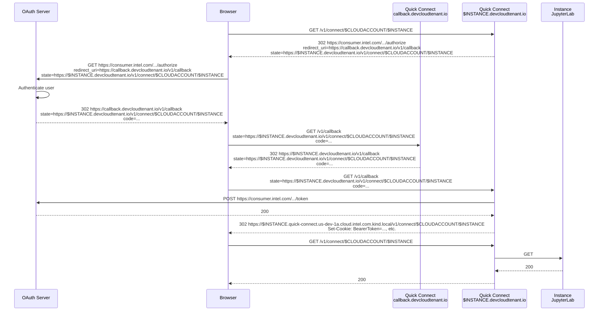

<!--INTEL CONFIDENTIAL-->
<!--Copyright (C) 2023 Intel Corporation-->
# Quick Connect

# Kind development environment

Quick Connect cannot be fully tested in the Kind development environment.
It is possible to test either the OAuth and reverse proxy flow or the JupyterLab instance.

## Wildcard name resolution

Existing external name resolution relies on entries added to /etc/hosts.
See details at [etc-hosts README.md](../../../deployment/common/etc-hosts/README.md).

Quick Connect requires resolving per-instance names which are not known at deployment time.
Instead of adding instance-specific names to /etc/hosts at runtime, dnsmasq can be used.

Disable systemd-resolved and replace it with dnsmasq:

    sudo systemctl stop systemd-resolved
    sudo systemctl disable systemd-resolved
    sudo unlink /etc/resolv.conf
    sudo vim /etc/resolv.conf
    nameserver 127.0.0.1
    nameserver 8.8.8.8
    sudo apt-get install dnsmasq
    sudo systemctl status dnsmasq

If behind the Proxy /etc/resolv.conf should include the Intel nameservers instead.
It may also be helpful to disable FQDN resolution of sudo while making the changes.

    sudo cat /etc/sudoers
    ...
    Defaults        !fqdn
    ...

    sudo cat /etc/resolv.conf
    nameserver 127.0.0.1
    nameserver 10.248.2.1
    nameserver 10.22.125.199
    nameserver 172.25.162.23

Configure dnsmasq to resolve and kind.local names to 127.0.2.2:

    cat <<EOF | tee /etc/dnsmasq.d/kind
    address=/kind.local/127.0.2.2
    EOF
    sudo systemctl restart dnsmasq

## Secrets

The Quick Connect service is an OAuth client, and requires client credentials.
`${SECRETS_DIR}/${availability_zone}-quick-connect-api-server-oauth-hmac` is created with make-secrets.sh, but
`${SECRETS_DIR}/${availability_zone}-quick-connect-api-server-oauth-token` must be created by the developer.
Contact <todd.malsbary@intel.com> to obtain the existing secret.

Creating a new client secret must be done at portal.azure.com.
Carefully review the Helm chart for setting other client values such as ID if this is done.

To succesfully test the OAuth flow, a non-intel.com cloud account is needed.
Create a non intel.com cloud account by going to e.g. [staging.console.idcservice.net](https://staging.console.idcservice.net/).
Use this email and password when testing the OAuth flow.

> Why is this necessary?
> The usual admin tokens used in testing with Kind will not validate against the Azure OAuth server.
> So we create a token that will validate against the Azure OAuth server and exercise the Quick Connect OAuth flow.
>
> For additional detail, decode the token and look at the value of the "aud" field.
> This field tells Envoy which OAuth server to contact.

## Creating instances

To create an instance with the non-intel.com account, it is necessary to use the admin token (via get_token.sh) but with the CLOUDACCOUNTNAME of a non-intel.com account.
In the example below, this external account is todd.malsbary@proton.me.

    export CLOUDACCOUNTNAME=todd.malsbary@proton.me
    source go/pkg/tools/oidc/test-scripts/get_token.sh
    go/svc/cloudaccount/test-scripts/cloud_account_create.sh
    export CLOUDACCOUNT=$(go/svc/cloudaccount/test-scripts/cloud_account_get_by_name.sh | jq -r .id)
    go/svc/compute_api_server/test-scripts/vnet_create_with_name.sh
    go/svc/compute_api_server/test-scripts/sshpublickey_create_with_name.sh
    go/svc/compute_api_server/test-scripts/instance_create_with_quick_connect_enabled.sh

Next, verify that the token of the external account can be used to list the instance.
The token can be grabbed by logging into the console and using developer tools to sniff it from the request headers.

    export TOKEN= # obtained from sniffing the browser, etc.
    go/svc/compute_api_server/test-scripts/instance_list.sh

## Tips

OAuth and JupyterLab require a browser to use.
In Flex, one way to do this is to use X.

Install Xming to deploy an X server.
Start XLaunch and use the default parameters.
Then in PowerShell:

    > $env:DISPLAY="localhost:0"
    > ssh -Y tmalsbar@pdx03-c01-rgcp001-vm-8
    $ CLOUDACCOUNT=...
    $ INSTANCE=...
    $ google-chrome --incognito https://${INSTANCE}.quick-connect.us-dev-1a.cloud.intel.com.kind.local/v1/connect/${CLOUDACCOUNT}/${INSTANCE}

## Connecting to JupyterLab

A client certificate issued by the Quick Connect client CA is required to connect to the JupyterLab service running in an Instance.

To create a client certificate:
- Login to the Vault UI: http://localhost:30990/ui/.
  The token can be found at local/secrets/VAULT_TOKEN.
- Click through Secrets Engines, us-dev-1a-quick-connect-client-ca, Roles, us-dev-1a-quick-connect-client, and finally Generate Certificate.
  Enter us-dev-1a-quick-connect-client.idcs-system.svc.cluster.local for the Common name then click Generate.
- SSH into the Instance.
  Copy the Private key into /tmp/client.key.
  Copy the Certificate and append *all but the last certificate* of the CA Chain into /tmp/client.pem.

Now you can connect to JupyterLab:

    curl -k --cacert /opt/idc_jupyterlab/jupyterlab.pem --cert /tmp/client.pem --key /tmp/client.key https://localhost:57066/v1/connect/{cloudaccountId}/{resourceID}/api/kernelspecs
