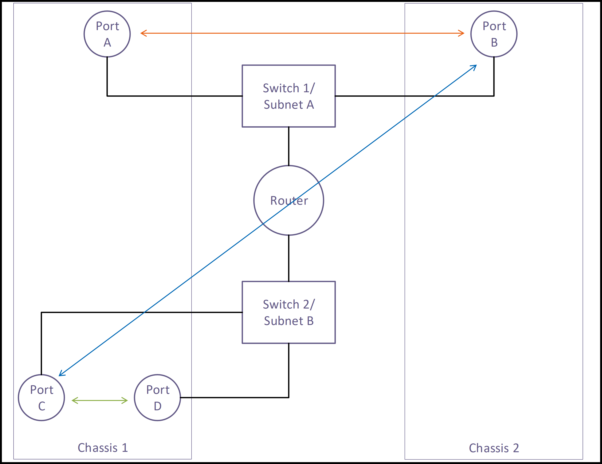

<!--INTEL CONFIDENTIAL-->
<!--Copyright (C) 2023 Intel Corporation-->
# ovn-com

PoC for OVN central communication

## Objective

The Objective of this PoC is to realize a Controller prototype that presents a gRPC based front-end and is able to communicate with an OVN Central instance over OVSDB protocol. Using a gRPC client it should be able to realize the network objects needed for basic East-West traffic as illustrated below. 

## Running the controller

The sdncontroller can be started in the following format using command line flags args (either with a single dash or a double dash):

./sdncontroller
./sdncontroller --ip=localhost
./sdncontroller -ip=10.10.10.5 -ovn-port=6641 -api-server-port=50051
./sdncontroller -ip=localhost -cfg=myconfig.yaml
./sdncontroller -h

Note:

- The controller uses either the command line parameters set as flags or the config file or just the default parameters.
- To use the config file, you can copy the config file from "examples/config/config.yaml" to the directory you run the controller from.
- To specify the name of the config file, one can use the "-cfg" flag. If the config file name has not been specified, the default name of the config file is "config.yaml".
- If no arguments are available either via the command line args, default args will be used (ip=localhost, ovn-port=6641, api-server-port=50051).
- The tie breaking rules will prefer command line parameters over the parameters supplied by the config file.
- A config parameter for database availability is also used called "Database available" which should be set to "yes" if you are using a database or "no" if you are not. In future this config parameter may be deprecated.

## Config File format

The config file is of YAML format. It is split into multiple sections:

- A General section. This is unmarshalled in the main config manager file, "configmgr/config.go". Currently, the only field in this section is the Config Version. This has to match the config version of the SDN controller. At this moment, if they do not match, we are only complaining of a version mismatch.
- Individual sections. These include sections for the configs for OVN Central, gRPC Server, Database, Service Area, etc. Corresponding to each section, there is a "configmgr/XYZ_config.go" file to unmarshal the YAML config into a golang structs.
- Currently, we are just noting the config file errors rather than stopping execution with a fatal error. Hence, if either the general section or the individual sections do not unmarshal properly, we just log the error and continue.
