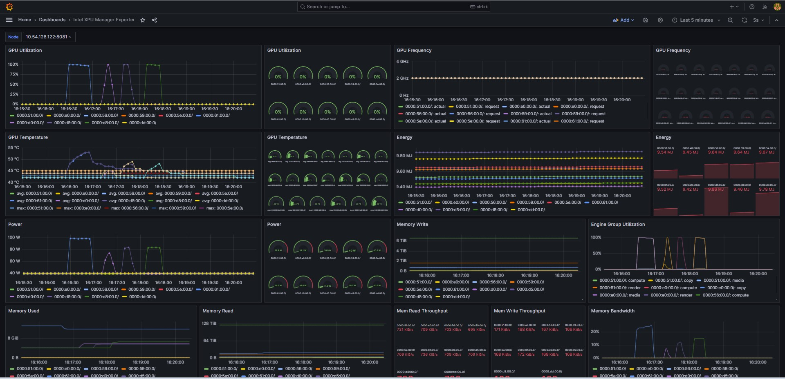

# Intel XPU Manager
Intel(R) XPU Manager is a free and open-source tool for monitoring and managing Intel data center GPUs.   
Refer to [Intel XPU Manager](https://github.com/intel/xpumanager) repo for details.   
By default, xpu-smi package is shipped together with Intel GPU Drivers.   
You can also download and install the latest version for either XPU Manager or xpu-smi from [xpumanager release](https://github.com/intel/xpumanager/releases)   

## Monitoring GPU telemetry from Grafana
Intel XPU Manager supports REST API to export the GPU telemetry and view from Grafana Dashboard.    
A sample output shows as below:   


To Enable this feature, please install the latest xpumanager (not the xpu-smi) from [xpumanager release](https://github.com/intel/xpumanager/releases)   
Follow the [Grafana dashboard setup guide for XPUM](https://github.com/intel/xpumanager/blob/master/rest/Grafana_dashboard_setup_guide_for_XPUM.md)   

## Tips
1. Reduce the interval from prometheus so the telemetry can be updated in Grafana more frequently.
```
# Update the prometheus.yml to set the interval to a new value, e.g. 2 seconds instead of the default 15 seconds.
global:
  scrape_interval: 2s # Set the scrape interval to every 2 seconds. Default is every 1 minute.
  evaluation_interval: 2s # Evaluate rules every 2 seconds. The default is every 1 minute.
```
2. Change the Grafana server port
```
# If needed, change the grafana server port, from default 3000 to 8080 for example
# Create a grafana.cfg file with following
[server]
http_port=8080

# Start the grafana server
./grafana server --config ./grafana.cfg

```

