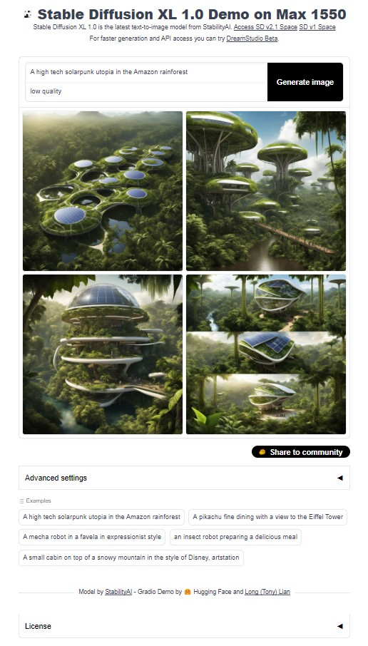

# StableDiffusion XL Gradio Demo WebUI on Intel Data Center GPU
The demo is based on the [stable-diffusion-demo](https://github.com/TonyLianLong/stable-diffusion-xl-demo) project, updated to support for Intel Data Center GPU.   
This demo is ONLY for testing purpose.   
The latest GPU driver, oneAPI 2024.0 and IPEX 2.1 are required.   
The demo is tested with GPU driver 736.25, oneAPI 2024.0 and IPEX 2.1 Public build.   

## Build the Docker image
Refer the steps in setup.sh
```
bash setup.sh

```

## Launch the Demo Instance
Once the instance launched, you will get the webUI link for the demo. By default, it is http://\<your host ip\>:8080. You can customize it in run.sh if needed.
Pass 4 GPU Tiles into the containers and enable MULTI_GPU=true can accelirate the inference significantly.

```
bash run.sh
```

## Run the demo
On a system with Chrome browser, open the link http://\<your host ip\>:8080 and enjoy.

