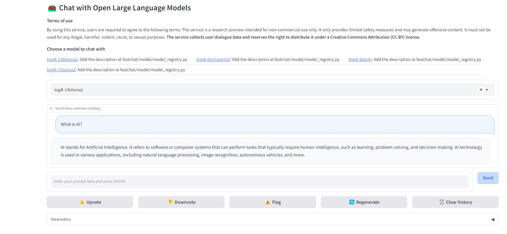

# BigDL-LLM
bigdl-llm is a library for running LLM (large language model) on Intel XPU using INT4 with very low latency for any PyTorch model.   
Refer to [BigDL-LLM](https://github.com/intel-analytics/BigDL) repo for further details.   
Refer to [GPU examples](https://github.com/intel-analytics/BigDL/tree/main/python/llm/example/GPU/HF-Transformers-AutoModels/Model) to start BigDL-LLM on Intel Data Center GPU.   

For example, [Llama-2](https://github.com/intel-analytics/BigDL/tree/main/python/llm/example/GPU/HF-Transformers-AutoModels/Model/llama2)   
Please use Python3.9 as of today for these examples as some bigdl-llm modules don't support other python version yet.   

To run benchmarks, following the [benchmark](https://github.com/intel-analytics/BigDL/tree/main/python/llm/dev/benchmark) instructions   

## Using BigDL-LLM with FastChat Quick Instructions
### Setup Working Environments
```
conda create -n bigdl-llm python=3.9
conda activate bigdl-llm
pip install --pre --upgrade bigdl-llm[xpu,serving] --extra-index-url https://pytorch-extension.intel.com/release-whl/stable/xpu/us/

# An important notes here.
# We observed very slow response from browser when print the tokens from server in the latest gradio server.
# In case you see the similar issue, to workaround the issue, please uninstall the current gradio package and reintall a previous version, e.g.
# In the current conda environment
pip install gradio==3.23.0

```
### Run the examples
In the current bigdl-llm conda environment, please make sure you can run the [GPU examples](https://github.com/intel-analytics/BigDL/tree/main/python/llm/example/GPU/HF-Transformers-AutoModels/Model)   
You can follow the instructions in the model folder, e.g. [llama2](https://github.com/intel-analytics/BigDL/tree/main/python/llm/example/GPU/HF-Transformers-AutoModels/Model/llama2), [gpt-j](https://github.com/intel-analytics/BigDL/tree/main/python/llm/example/GPU/HF-Transformers-AutoModels/Model/gpt-j), [ChatGLM2](https://github.com/intel-analytics/BigDL/tree/main/python/llm/example/GPU/HF-Transformers-AutoModels/Model/chatglm2) ...   
Run these examples, the huggingface models will be downloaded to your local disks, by default, in ~/.cache/huggingface folder.

### Prepare Models
Download the huggingface model and save it in a local folder. Huggingface models usually stored in the ~/.cache/huggingface folder by default.   
Copy the model to a local folder and rename the folder name to bigdl-xxx, e.g. for gpt-j 6b model:   
```
mkdir -p workspace_bigdl_llm/models/bigdl-6b-gptj
cd workspace_bigdl_llm/models/bigdl-6b-gptj
cp ~/.cache/huggingface/hub/models--EleutherAI--gpt-j-6B/snapshots/f98c709453c9402b1309b032f40df1c10ad481a2/* ./
```
Alternatively you can simply create a symbolic to the model folder, e.g.
```
cd workspace_bigdl_llm/models
ln -s ~/.cache/huggingface/hub/models--EleutherAI--gpt-j-6B/snapshots/f98c709453c9402b1309b032f40df1c10ad481a2 bigdl-6b-gptj
```

For Llama2 models, for example [meta-llama/Llama-2-13b-chat-hf](https://huggingface.co/meta-llama/Llama-2-13b-chat-hf):   
You will need to   
1) Get approval from Meta   
2) Get approval from HF   
3) Create a read token from here : https://huggingface.co/settings/tokens   
4) execute huggingface-cli login and provide read token   
5) Execute your code. It should work similar as other models now   

For detailed instructions, refer to https://huggingface.co/meta-llama/Llama-2-13b-chat-hf    
Once you downloaded the model, we can copy the llama2 models files in a local folder, e.g. workspace_bigdl_llm/models/bigdl-13b-llama2   

### Start Serving with WebGUI
```
# Make sure you are in the conda environment bigdl-llm in each console

# In console 1, launch the controller
python3 -m fastchat.serve.controller

# In console 2, launch the model worker
# Use Llama-2 as example, this will launch the model worker for Llama-2 model. 
cd worksapce_bigdl_llm
source /opt/intel/oneapi/setvars.sh
python3 -m bigdl.llm.serving.model_worker --model-path ./models/bigdl-13b-llama2 --device xpu
# Wait until the process finishes loading the model and you see "Uvicorn running on ...". The model worker will register itself to the controller

# By default, the model will loaded in the GPU device 0.
# If you have multiple GPUs and want to load different models in dedicated GPU, you can do following
# Load bigdl-13b-llama2 in GPU 0 for example:
ZE_AFFINITY_MASK=0 python3 -m bigdl.llm.serving.model_worker --model-path ./models/bigdl-13b-llama2/ --device xpu --port 21002 --worker-address "http://localhost:21002"
# Load bigdl-6b-gptj in GPU 1 for example:
ZE_AFFINITY_MASK=1 python3 -m bigdl.llm.serving.model_worker --model-path ./models/bigdl-6b-gptj/ --device xpu --port 21003 --worker-address "http://localhost:21003"
# Specify the different port for different models, starting from 21002

# In console 3, launch the web server
source /opt/intel/oneapi/setvars.sh
python3 -m fastchat.serve.gradio_web_server --host <your server system IP address> --port <web server port, e.g. 8080>


```

### Launch Browser to Chat with LLM
Launch a browser on any of system to visit the LLM server by using http://\<your server system IP address\>:\<web server port\>   
You can now talk with LLM   



If you have multiple models running on different GPU, you can select the model in this fastchat WebUI to activate it.

### Fastchat Demo
Dockerfile and scripts files are provided in [demo/docker](demo/docker/README.md) for quick start.