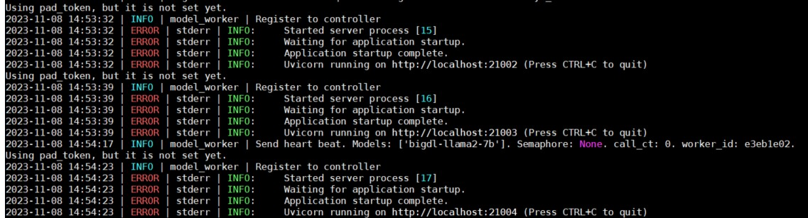
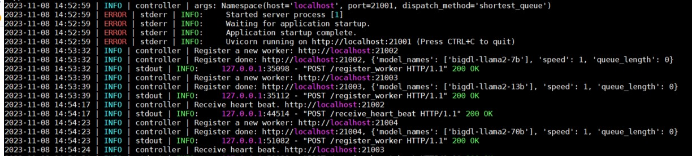
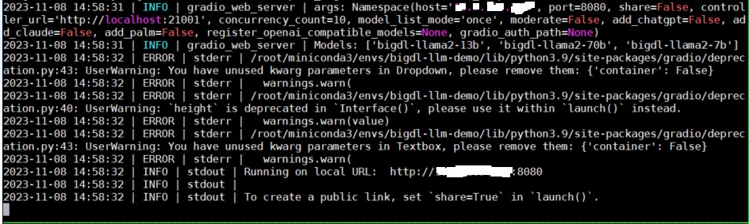
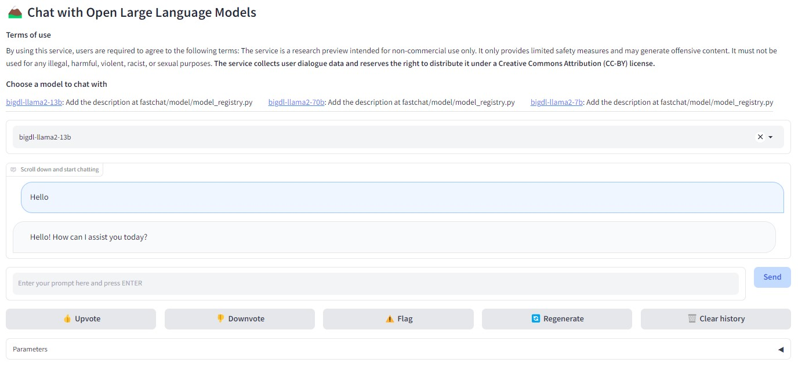

# Fastchat demo with BigDL LLM
Docker container is used to host the demo. Make sure you have docker installed on your host system before using this demo.   
The OOB scripts are provided here for easy setup and deployment. You can refer to [BigDL LLM Instructions](https://github.com/intel-analytics/BigDL/tree/main/docker/llm) for further detais.

## Build the Demo Image
Run setup.sh to build the docker image. Once finished, you can find the docker image "bigdl-llm-fastchat-demo" through "docker image ls"
```
bash setup.sh
```

## Launch the Demo Instance
3 steps are required in order to launch the demo.
### Step 1: Start the controller. In first console,
```
bash run_step1.sh
```

### Step 2: Start the model worker. In second console,
by default, 3 models are used: meta-llama/Llama-2-7b-chat-hf, meta-llama/Llama-2-13b-chat-hf, meta-llama/Llama-2-70b-chat-hf   
This is to demonstrate the Llama2 models running on different GPUs in a multi-GPU system.   
The scripts uses the models from host system. You need to have the models downloaded in your local disks.   
You may need to change the scripts to locate the right model folder if you have a different model path.   
Please do customize the scripts run_step2.sh to use the right model path in container.   
You may also need to update the file scripts/02_start_models.sh if you uses a different model for demo.   
```
bash run_step2.sh
```
Once the step2 done, the model will be registered to the controller instance.   
From console in step 2, you can find messages similar like below.   


From console in step 2, you can find messages similar like below.   


Make sure the models are registered before you start the step 3.

# Step 3: Start the webserver. In third console, 
```
bash run_step3.sh
```
You may change the port number if needed. By default it uses 8080 port for the webUI.    
Once the step3 done, you can find the web service started.   


## Run the demo
On a client system with browser support, open the browser and use the URL http://\<host ip\>:8080 to run the demo and enjoy.


